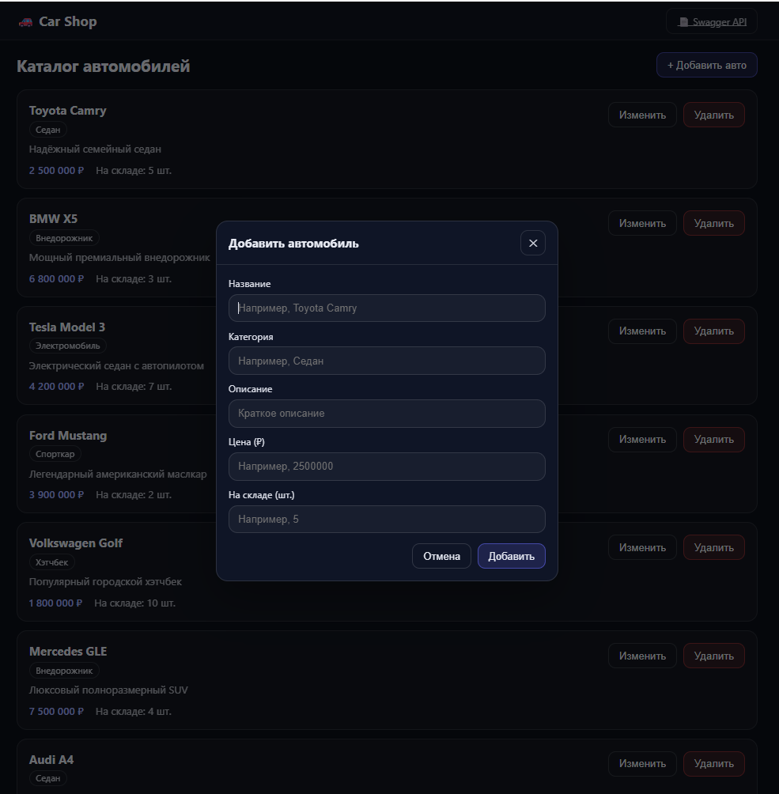
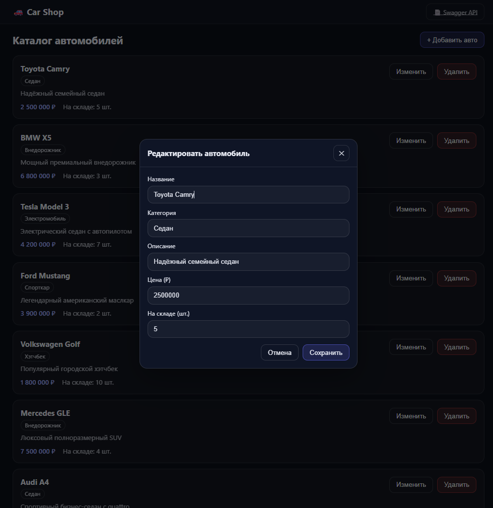

# 🚗 Frontend & Backend — Cars (Практики 1–6)

Репозиторий с практическими заданиями по дисциплине **«Фронтенд и бэкенд разработка»**  
Институт ИПТИП, кафедра Индустриального программирования, 4 семестр 2025/2026.  
**Тема индивидуального задания: Автомобили.**

Проект покрывает цикл разработки веб-приложения: стилизация (Sass) → REST API (Express) → тестирование (Postman) → клиент (React) → документация (Swagger) → итоговая сборка в единый проект.

---

## 📁 Структура репозитория

| Папка | Что внутри | Результат |
|---|---|---|
| `practice-01-car-card` | Sass (SCSS), HTML-страница | Карточки автомобилей, демонстрация возможностей препроцессора |
| `practice-02-car-api` | Express API (CRUD) | Сервер с эндпоинтами для автомобилей |
| `practice-03-postman` | Postman коллекции/запросы | Проверка CRUD и работа с JSON |
| `practice-04-car-shop` | React клиент + Express сервер | Мини-магазин автомобилей (CRUD через UI) |
| `practice-05-swagger` | Express + Swagger (OpenAPI) | Интерактивная документация API на `/api-docs` |
| `practice-06-final` | **Единый итоговый проект** | React + Express API + Swagger + Sass в одном месте |

---

## 🧰 Технологии

- **Node.js + npm** — установка зависимостей, запуск серверов/клиента
- **Express.js** — REST API, обработка маршрутов, middleware, JSON
- **CORS** — разрешение запросов с клиента (React) к серверу
- **nanoid** — генерация коротких уникальных `id`
- **React** — клиентское приложение (каталог, модалки, формы)
- **Sass (SCSS)** — стили с переменными, миксинами, вложенностью
- **Swagger (swagger-jsdoc + swagger-ui-express)** — автогенерация документации из JSDoc

---

## ⚙️ Общие требования

- Node.js **18+**
- npm **9+**
- Postman (для практики 3)

---

# ✅ Практика 1 — CSS-препроцессор (Sass)

## Цель
Показать использование Sass: переменные, миксины, вложенность, условные конструкции, циклы и компиляция в CSS.

## Что реализовано
- Карточки автомобилей (пример компонента UI)
- Sass-конструкции:
  - переменные для цветов/размеров
  - миксины для кнопок/карточек
  - вложенность (`&__title`, `&--accent`)
  - условие темы (`@if`)
  - генерация классов через `@each`

## Как запустить
```bash
cd practice-01-car-card
npm install
npm run sass
```
Открыть `src/index.html` в браузере.

---

# ✅ Практика 2 — Node.js + Express REST API

## Цель
Создать сервер на Express и реализовать CRUD для сущности автомобиль.

## Данные
Сущность автомобиля:
- `id` — идентификатор
- `name` — название
- `price` — стоимость

## Маршруты
| Метод | Путь | Описание |
|---|---|---|
| GET | /cars | Список всех автомобилей |
| GET | /cars/:id | Получить по id |
| POST | /cars | Создать |
| PATCH | /cars/:id | Обновить |
| DELETE | /cars/:id | Удалить |

## Как запустить
```bash
cd practice-02-car-api
npm install
npm start
```
Сервер: `http://localhost:3000`

---

# ✅ Практика 3 — JSON и Postman

## Цель
Проверить API запросами из Postman и закрепить работу с JSON.

## Что сделано
- CRUD-запросы к API (POST, GET, PATCH, DELETE)
- Проверка статусов (200/201/204/400/404)
- Проверка тела ответа и обработки ошибок

## Как повторить
1. Запустить сервер из практики 2
2. В Postman выполнить запросы из коллекции

---

# ✅ Практика 4 — React + Express (Car Shop)

## Цель
Собрать полноценное приложение: React-клиент + Express-сервер, CRUD через UI.

## Сервер
- Держит массив из **10 автомобилей** (демо-данные)
- Отдаёт JSON по API (`/api/cars`)
- Поддерживает CRUD операции

## Клиент (React)
- Главная страница каталога: список, добавление, редактирование, удаление
- Модальное окно: форма с полями авто, отправка запросов на сервер

## Как запустить
```bash
# Сервер
cd practice-04-car-shop/server
npm install
npm start

# Клиент (в другом терминале)
cd practice-04-car-shop/client
npm install
npm start
```
Сервер: `http://localhost:3000`  
Клиент: `http://localhost:3001`

---

# ✅ Практика 5 — Swagger документация

## Цель
Сделать документацию REST API в формате OpenAPI/Swagger с тестированием эндпоинтов из браузера.

## Как работает
- `swagger-jsdoc` читает JSDoc-комментарии `@swagger` в коде сервера
- Формируется OpenAPI спецификация
- `swagger-ui-express` показывает UI по адресу `/api-docs`

## Результат
- Интерактивная страница со списком эндпоинтов
- Описание схемы данных `Car`
- Кнопка **Try it out** для тестирования реальных запросов

## Как запустить
```bash
cd practice-05-swagger
npm install
npm start
```
Swagger UI: `http://localhost:3000/api-docs`

---

# ⭐ Практика 6 — Итоговый проект

## Цель
Объединить результаты практик 1–5 в единое приложение:
- UI (React) + стили (Sass)
- API (Express CRUD)
- Документация (Swagger)
- Единые команды запуска

## Структура
```text
practice-06-final/
  client/   # React UI
  server/   # Express API + Swagger
```

## 🖥️ Сервер

### Что реализовано
- `express.json()` — чтение JSON тела запросов
- CORS — разрешение запросов с `http://localhost:3001`
- Логирование запросов (метод, путь, статус, body для POST/PATCH)
- 404 handler и global error handler (500)
- CRUD по автомобилям: `/api/cars`
- Swagger UI: `/api-docs`
- `nanoid` — генерация `id` при создании новых авто

### Модель данных (Car)
| Поле | Тип | Описание |
|---|---|---|
| `id` | string | Уникальный идентификатор (nanoid) |
| `name` | string | Название автомобиля |
| `category` | string | Категория (Седан, SUV и т.д.) |
| `description` | string | Краткое описание |
| `price` | number | Стоимость в рублях |
| `stock` | number | Количество на складе |

### API эндпоинты
| Метод | Путь | Описание | Статус |
|---|---|---|---|
| GET | /api/cars | Все автомобили | 200 |
| GET | /api/cars/:id | Авто по id | 200 / 404 |
| POST | /api/cars | Создать авто | 201 / 400 |
| PATCH | /api/cars/:id | Обновить авто | 200 / 404 |
| DELETE | /api/cars/:id | Удалить авто | 204 / 404 |
| GET | /api-docs | Swagger UI | 200 |

### Запуск сервера
```bash
cd practice-06-final/server
npm install
npm start
```
Сервер: `http://localhost:3000`  
Swagger: `http://localhost:3000/api-docs`

---

## 🌐 Клиент

### Что реализовано
- React-приложение (Create React App)
- Каталог автомобилей: список из 10 авто
- Кнопка «+ Добавить авто» — открывает модальное окно с формой
- Кнопки «Изменить» / «Удалить» у каждого авто
- Ссылка «Swagger API» в шапке — открывает документацию
- Стили написаны на SCSS (Sass): переменные, миксины, тёмная тема

### Запуск клиента
```bash
cd practice-06-final/client
npm install
npm start
```
Клиент: `http://localhost:3001`

---

## 🔗 Адреса итогового проекта

| URL | Описание |
|---|---|
| `http://localhost:3001` | React-приложение (интернет-магазин автомобилей) |
| `http://localhost:3000/api/cars` | REST API (JSON) |
| `http://localhost:3000/api-docs` | Swagger UI (документация) |

---

## 📸 Скриншоты

### Каталог автомобилей


### Добавление автомобиля


### Редактирование автомобиля


### Swagger UI — список маршрутов


### Swagger UI — тестирование запроса GET /api/cars


---

## 🚀 Быстрый старт (итоговый проект)

```bash
# Терминал 1 — сервер
cd practice-06-final/server
npm install
npm start

# Терминал 2 — клиент
cd practice-06-final/client
npm install
npm start
```

---
